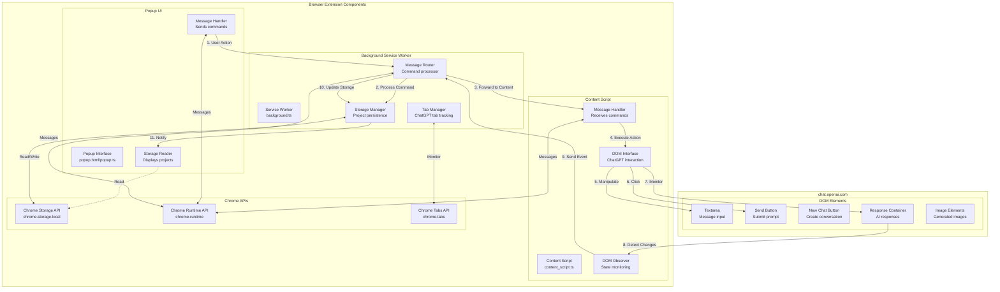

# ChatGPT Browser Extension Architecture

## Overview

This document provides a comprehensive architectural overview of the ChatGPT browser extension, detailing message flows, storage schemas, and DOM interaction patterns for seamless integration with chat.openai.com.

## Core Architecture Principles

1. **Message-Driven Communication**: Type-safe message passing between components
2. **Reactive DOM Integration**: Event-driven interaction with ChatGPT interface
3. **Persistent Project Management**: Structured storage for projects and instructions
4. **Security-First Design**: Input validation and secure communication patterns

## Extension Architecture Diagram



## Message Flow Architecture

### 1. Popup → Background → Content Script Flow

```typescript
// Message flow for sending a prompt
interface MessageFlow {
    // Step 1: User clicks "Send Prompt" in popup
    popup_action: {
        type: 'EXECUTE_ACTION';
        action: 'SEND_PROMPT';
        data: {
            prompt: string;
            projectId?: string;
        };
    };
    
    // Step 2: Background receives and processes
    background_processing: {
        validate_request: boolean;
        check_active_tab: boolean;
        load_project_context?: boolean;
        forward_to_content: boolean;
    };
    
    // Step 3: Content script executes on DOM
    content_execution: {
        find_textarea: boolean;
        insert_prompt: boolean;
        trigger_send: boolean;
        monitor_response: boolean;
    };
    
    // Step 4: Response flows back
    response_flow: {
        content_to_background: {
            type: 'RESPONSE_RECEIVED';
            data: { response: string; timestamp: number };
        };
        background_to_popup: {
            type: 'UPDATE_UI';
            data: { status: 'complete'; response: string };
        };
    };
}
```

### 2. Message Protocol

```typescript
// Standardized message structure
interface ExtensionMessage {
    // Message identification
    id: string;                    // Unique message ID
    timestamp: number;             // Message timestamp
    source: 'popup' | 'background' | 'content';
    target: 'popup' | 'background' | 'content';
    
    // Message content
    type: MessageType;             // Message type enum
    action?: ActionType;           // Specific action
    data?: any;                    // Payload
    
    // Response handling
    expectsResponse?: boolean;     // Whether sender expects response
    timeout?: number;              // Response timeout in ms
}

// Message type definitions
enum MessageType {
    // Project management
    CREATE_PROJECT = 'CREATE_PROJECT',
    GET_PROJECTS = 'GET_PROJECTS',
    UPDATE_PROJECT = 'UPDATE_PROJECT',
    DELETE_PROJECT = 'DELETE_PROJECT',
    
    // Instructions
    ADD_INSTRUCTIONS = 'ADD_INSTRUCTIONS',
    GET_INSTRUCTIONS = 'GET_INSTRUCTIONS',
    
    // ChatGPT actions
    EXECUTE_ACTION = 'EXECUTE_ACTION',
    
    // Status
    CHECK_STATUS = 'CHECK_STATUS',
    CONNECTION_STATE = 'CONNECTION_STATE'
}

// Action types for ChatGPT
enum ActionType {
    CREATE_CHAT = 'CREATE_CHAT',
    SEND_PROMPT = 'SEND_PROMPT',
    REQUEST_IMAGE = 'REQUEST_IMAGE',
    DOWNLOAD_IMAGES = 'DOWNLOAD_IMAGES'
}
```

## Storage Schema

### Project Storage Structure

```typescript
// Storage schema for projects and instructions
interface StorageSchema {
    // Root storage key
    chatgpt_projects: Project[];
    
    // Settings storage
    settings: ExtensionSettings;
    
    // Session data
    session: SessionData;
}

// Project entity
interface Project {
    id: string;                    // Unique project ID (project-timestamp)
    name: string;                  // User-friendly project name
    instructions: Instruction[];   // Array of instructions
    created: string;              // ISO timestamp
    updated: string;              // ISO timestamp
    metadata?: {
        description?: string;
        tags?: string[];
        color?: string;
        icon?: string;
    };
}

// Instruction entity
interface Instruction {
    id: string;                    // Unique instruction ID
    text: string;                  // Instruction content
    created: string;              // ISO timestamp
    type?: 'system' | 'user';     // Instruction type
    priority?: number;            // Execution priority
}

// Extension settings
interface ExtensionSettings {
    autoInjectInstructions: boolean;
    defaultProjectId?: string;
    theme: 'light' | 'dark' | 'auto';
    shortcuts: {
        newChat: string;          // e.g., "Ctrl+Shift+N"
        sendPrompt: string;       // e.g., "Ctrl+Enter"
    };
}

// Session data
interface SessionData {
    activeProjectId?: string;
    lastChatUrl?: string;
    recentPrompts: string[];
    statistics: {
        promptsSent: number;
        imagesGenerated: number;
        chatsCreated: number;
    };
}
```

### Storage Operations

```typescript
// Storage manager implementation
class StorageManager {
    private readonly STORAGE_KEYS = {
        PROJECTS: 'chatgpt_projects',
        SETTINGS: 'settings',
        SESSION: 'session'
    };
    
    // Project operations
    async createProject(project: Omit<Project, 'id' | 'created' | 'updated'>): Promise<Project> {
        const newProject: Project = {
            ...project,
            id: `project-${Date.now()}`,
            created: new Date().toISOString(),
            updated: new Date().toISOString(),
            instructions: []
        };
        
        const projects = await this.getAllProjects();
        projects.push(newProject);
        await chrome.storage.local.set({ [this.STORAGE_KEYS.PROJECTS]: projects });
        
        return newProject;
    }
    
    // Instruction operations
    async addInstruction(projectId: string, instruction: Omit<Instruction, 'id' | 'created'>): Promise<Instruction> {
        const projects = await this.getAllProjects();
        const project = projects.find(p => p.id === projectId);
        
        if (!project) {
            throw new Error(`Project ${projectId} not found`);
        }
        
        const newInstruction: Instruction = {
            ...instruction,
            id: `inst-${Date.now()}`,
            created: new Date().toISOString()
        };
        
        project.instructions.push(newInstruction);
        project.updated = new Date().toISOString();
        
        await chrome.storage.local.set({ [this.STORAGE_KEYS.PROJECTS]: projects });
        
        return newInstruction;
    }
    
    // Batch operations for performance
    async batchUpdate(updates: Partial<StorageSchema>): Promise<void> {
        await chrome.storage.local.set(updates);
    }
}
```

## DOM Interaction Patterns

### ChatGPT DOM Interface

```typescript
// DOM selectors and interaction patterns
class ChatGPTDOMInterface {
    // Selectors for ChatGPT elements
    private readonly SELECTORS = {
        // Input elements
        TEXTAREA: 'textarea[data-id]',
        SEND_BUTTON: 'button[data-testid="send-button"]',
        
        // Navigation
        NEW_CHAT_BUTTON: 'a[href="/"]',
        CHAT_LIST: 'nav ol',
        
        // Content
        RESPONSE_CONTAINER: 'div[data-testid="conversation-turn"]',
        AI_RESPONSE: 'div[data-message-author-role="assistant"]',
        USER_MESSAGE: 'div[data-message-author-role="user"]',
        
        // Images
        GENERATED_IMAGES: 'img[src*="dalle"], img[src*="openai"]',
        IMAGE_CONTAINER: 'div[data-testid="image-container"]'
    };
    
    // Core interaction methods
    async sendPrompt(prompt: string): Promise<void> {
        // Step 1: Find textarea
        const textarea = await this.waitForElement(this.SELECTORS.TEXTAREA);
        if (!textarea) throw new Error('ChatGPT textarea not found');
        
        // Step 2: Set value with proper event simulation
        await this.setTextareaValue(textarea as HTMLTextAreaElement, prompt);
        
        // Step 3: Find and click send button
        const sendButton = await this.waitForElement(this.SELECTORS.SEND_BUTTON);
        if (!sendButton || (sendButton as HTMLButtonElement).disabled) {
            throw new Error('Send button not available');
        }
        
        (sendButton as HTMLButtonElement).click();
        
        // Step 4: Wait for response
        await this.waitForResponse();
    }
    
    private async setTextareaValue(textarea: HTMLTextAreaElement, value: string): Promise<void> {
        // React-compatible value setting
        const nativeInputValueSetter = Object.getOwnPropertyDescriptor(
            window.HTMLTextAreaElement.prototype,
            'value'
        )?.set;
        
        if (nativeInputValueSetter) {
            nativeInputValueSetter.call(textarea, value);
        } else {
            textarea.value = value;
        }
        
        // Trigger React's onChange
        textarea.dispatchEvent(new Event('input', { bubbles: true }));
        textarea.dispatchEvent(new Event('change', { bubbles: true }));
    }
    
    // Response monitoring
    async waitForResponse(): Promise<string> {
        return new Promise((resolve, reject) => {
            const observer = new MutationObserver((mutations, obs) => {
                // Look for new AI response
                const responses = document.querySelectorAll(this.SELECTORS.AI_RESPONSE);
                const latestResponse = responses[responses.length - 1];
                
                if (latestResponse) {
                    // Check if response is complete (no streaming indicator)
                    const isStreaming = latestResponse.querySelector('.result-streaming');
                    if (!isStreaming) {
                        obs.disconnect();
                        resolve(latestResponse.textContent || '');
                    }
                }
            });
            
            observer.observe(document.body, {
                childList: true,
                subtree: true,
                characterData: true
            });
            
            // Timeout after 30 seconds
            setTimeout(() => {
                observer.disconnect();
                reject(new Error('Response timeout'));
            }, 30000);
        });
    }
    
    // Image handling
    async downloadImages(): Promise<ImageDownload[]> {
        const images = document.querySelectorAll(this.SELECTORS.GENERATED_IMAGES);
        const downloads: ImageDownload[] = [];
        
        for (const img of images) {
            const src = (img as HTMLImageElement).src;
            if (!src) continue;
            
            try {
                const response = await fetch(src);
                const blob = await response.blob();
                const dataUrl = await this.blobToDataUrl(blob);
                
                downloads.push({
                    url: src,
                    dataUrl,
                    filename: `chatgpt-image-${Date.now()}-${downloads.length}.png`,
                    timestamp: Date.now()
                });
            } catch (error) {
                console.error('Failed to download image:', error);
            }
        }
        
        return downloads;
    }
    
    // Utility methods
    private waitForElement(selector: string, timeout = 5000): Promise<Element | null> {
        return new Promise((resolve) => {
            const element = document.querySelector(selector);
            if (element) {
                resolve(element);
                return;
            }
            
            const observer = new MutationObserver((mutations, obs) => {
                const element = document.querySelector(selector);
                if (element) {
                    obs.disconnect();
                    resolve(element);
                }
            });
            
            observer.observe(document.body, {
                childList: true,
                subtree: true
            });
            
            setTimeout(() => {
                observer.disconnect();
                resolve(null);
            }, timeout);
        });
    }
}
```

### State Monitoring Pattern

```typescript
// State monitoring for ChatGPT interface
class ChatGPTStateMonitor {
    private observer: MutationObserver | null = null;
    private state: ChatGPTState = {
        ready: false,
        busy: false,
        connected: false,
        currentChat: null
    };
    
    start(): void {
        this.observer = new MutationObserver(() => {
            this.updateState();
        });
        
        this.observer.observe(document.body, {
            childList: true,
            subtree: true,
            attributes: true,
            attributeFilter: ['data-testid', 'disabled', 'aria-label']
        });
        
        // Initial state check
        this.updateState();
    }
    
    private updateState(): void {
        const oldState = { ...this.state };
        
        // Check if ChatGPT is ready
        this.state.ready = !!document.querySelector('textarea[data-id]');
        
        // Check if busy (send button disabled)
        const sendButton = document.querySelector('button[data-testid="send-button"]') as HTMLButtonElement;
        this.state.busy = sendButton?.disabled || false;
        
        // Check connection status
        this.state.connected = !document.querySelector('.connection-error');
        
        // Notify if state changed
        if (JSON.stringify(oldState) !== JSON.stringify(this.state)) {
            this.notifyStateChange(this.state);
        }
    }
    
    private notifyStateChange(state: ChatGPTState): void {
        chrome.runtime.sendMessage({
            type: 'CHATGPT_STATE_CHANGE',
            data: state
        });
    }
}

interface ChatGPTState {
    ready: boolean;
    busy: boolean;
    connected: boolean;
    currentChat: string | null;
}
```

## API Patterns

### Core API Implementation

```typescript
// Extension API for 6 core features
class ChatGPTExtensionAPI {
    constructor(
        private storageManager: StorageManager,
        private messageHandler: MessageHandler,
        private domInterface: ChatGPTDOMInterface
    ) {}
    
    // 1. Create Project
    async createProject(name: string, metadata?: ProjectMetadata): Promise<Project> {
        return await this.storageManager.createProject({ name, metadata });
    }
    
    // 2. Add Instructions
    async addInstructions(projectId: string, text: string, type: 'system' | 'user' = 'user'): Promise<Instruction> {
        return await this.storageManager.addInstruction(projectId, { text, type });
    }
    
    // 3. Create Chat
    async createChat(): Promise<void> {
        return await this.messageHandler.sendToContent({
            type: 'EXECUTE_ACTION',
            action: 'CREATE_CHAT'
        });
    }
    
    // 4. Send Prompt
    async sendPrompt(prompt: string, options?: SendPromptOptions): Promise<void> {
        // Optionally inject project instructions
        if (options?.projectId) {
            const project = await this.storageManager.getProject(options.projectId);
            if (project && options.includeInstructions) {
                const instructions = project.instructions.map(i => i.text).join('\n');
                prompt = `${instructions}\n\n${prompt}`;
            }
        }
        
        return await this.messageHandler.sendToContent({
            type: 'EXECUTE_ACTION',
            action: 'SEND_PROMPT',
            data: { prompt }
        });
    }
    
    // 5. Request Image
    async requestImage(description: string): Promise<void> {
        const imagePrompt = `Please generate an image: ${description}`;
        return await this.sendPrompt(imagePrompt);
    }
    
    // 6. Download Images
    async downloadImages(): Promise<ImageDownload[]> {
        const response = await this.messageHandler.sendToContent({
            type: 'EXECUTE_ACTION',
            action: 'DOWNLOAD_IMAGES',
            expectsResponse: true
        });
        
        return response.data.images;
    }
}

interface SendPromptOptions {
    projectId?: string;
    includeInstructions?: boolean;
}

interface ImageDownload {
    url: string;
    dataUrl: string;
    filename: string;
    timestamp: number;
}
```

## Security Considerations

### Content Security Policy

```json
{
    "content_security_policy": {
        "extension_pages": "script-src 'self'; object-src 'self'"
    },
    "permissions": [
        "storage",
        "tabs",
        "activeTab"
    ],
    "host_permissions": [
        "https://chat.openai.com/*"
    ]
}
```

### Security Patterns

```typescript
// Security-focused implementation patterns
class SecurityManager {
    // Validate all external inputs
    validatePrompt(prompt: string): string {
        // Remove potential XSS vectors
        return prompt
            .replace(/<script[^>]*>.*?<\/script>/gi, '')
            .replace(/<iframe[^>]*>.*?<\/iframe>/gi, '')
            .trim();
    }
    
    // Secure message validation
    validateMessage(message: ExtensionMessage): boolean {
        // Validate source
        if (!['popup', 'background', 'content'].includes(message.source)) {
            return false;
        }
        
        // Validate structure
        if (!message.id || !message.type || !message.timestamp) {
            return false;
        }
        
        // Validate timestamp (not too old)
        const maxAge = 5 * 60 * 1000; // 5 minutes
        if (Date.now() - message.timestamp > maxAge) {
            return false;
        }
        
        return true;
    }
    
    // Secure storage
    async encryptSensitiveData(data: any): Promise<string> {
        // Implementation would use Web Crypto API
        // This is a placeholder for the pattern
        return JSON.stringify(data);
    }
}
```

## Performance Optimization

### Optimization Patterns

```typescript
// Performance optimization strategies
class PerformanceOptimizer {
    // Debounced operations
    private debouncedSave = debounce(this.saveToStorage.bind(this), 1000);
    
    // Batch DOM operations
    async batchDOMOperations(operations: DOMOperation[]): Promise<void> {
        requestAnimationFrame(() => {
            operations.forEach(op => op.execute());
        });
    }
    
    // Cache frequently accessed data
    private cache = new Map<string, CachedData>();
    
    async getCachedProjects(): Promise<Project[]> {
        const cacheKey = 'projects';
        const cached = this.cache.get(cacheKey);
        
        if (cached && Date.now() - cached.timestamp < 60000) {
            return cached.data;
        }
        
        const projects = await this.loadProjects();
        this.cache.set(cacheKey, {
            data: projects,
            timestamp: Date.now()
        });
        
        return projects;
    }
}

interface CachedData {
    data: any;
    timestamp: number;
}

interface DOMOperation {
    execute(): void;
}
```

## Error Handling

### Comprehensive Error Strategy

```typescript
// Error handling patterns
class ErrorHandler {
    // Error types
    static readonly ERROR_CODES = {
        CHATGPT_NOT_READY: 'E001',
        MESSAGE_TIMEOUT: 'E002',
        STORAGE_ERROR: 'E003',
        DOM_NOT_FOUND: 'E004',
        NETWORK_ERROR: 'E005'
    };
    
    // Central error handler
    static async handle(error: ExtensionError): Promise<void> {
        console.error(`[${error.code}] ${error.message}`, error.details);
        
        // User notification for critical errors
        if (error.severity === 'critical') {
            await this.notifyUser(error);
        }
        
        // Log to storage for debugging
        await this.logError(error);
        
        // Attempt recovery
        if (error.recoverable) {
            await this.attemptRecovery(error);
        }
    }
    
    // Retry mechanism
    static async retry<T>(
        operation: () => Promise<T>,
        options: RetryOptions = {}
    ): Promise<T> {
        const { maxAttempts = 3, delay = 1000, backoff = 2 } = options;
        
        for (let attempt = 1; attempt <= maxAttempts; attempt++) {
            try {
                return await operation();
            } catch (error) {
                if (attempt === maxAttempts) throw error;
                
                await new Promise(resolve => 
                    setTimeout(resolve, delay * Math.pow(backoff, attempt - 1))
                );
            }
        }
        
        throw new Error('Max retry attempts reached');
    }
}

interface ExtensionError {
    code: string;
    message: string;
    severity: 'low' | 'medium' | 'high' | 'critical';
    recoverable: boolean;
    details?: any;
}

interface RetryOptions {
    maxAttempts?: number;
    delay?: number;
    backoff?: number;
}
```

## Summary

This architecture provides a robust foundation for the ChatGPT browser extension with:

1. **Clear Message Flow**: Well-defined communication patterns between all components
2. **Structured Storage**: Organized schema for projects and instructions
3. **Reliable DOM Interaction**: Robust patterns for interacting with ChatGPT's interface
4. **Security First**: Built-in security measures and input validation
5. **Performance Optimized**: Caching, batching, and debouncing strategies
6. **Error Resilient**: Comprehensive error handling and recovery mechanisms

The architecture supports all 6 core features while maintaining extensibility for future enhancements.