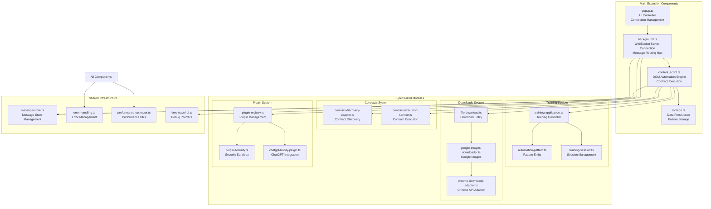
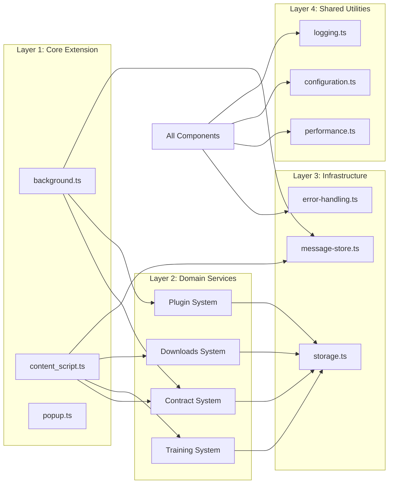

# Extension Component Relationships Analysis

## Overview

Analysis of the extension.chrome/src structure reveals a **Web-Buddy automation extension** with sophisticated component relationships and architecture patterns.

## Core Component Architecture



## Component Relationship Analysis

### 1. **Core Extension Pipeline**

**Message Flow**: `Popup → Background → Content Script → DOM`

- **background.ts**: Central message router with WebSocket server integration
- **content_script.ts**: DOM automation engine with contract-based execution
- **popup.ts**: UI controller for connection management
- **storage.ts**: Persistent data layer for patterns and interactions

### 2. **Contract-Based Automation System**

**Advanced Pattern**: Contract discovery → Execution → Fallback to patterns

```typescript
// Contract execution flow
CS (content_script.ts) 
  ├── contractExecution.executeWithContract()
  ├── contractDiscovery.discoverContracts()
  └── fallback to webBuddyStorage patterns
```

**Components**:
- `contract-discovery-adapter.ts`: Discovers available automation contracts
- `contract-execution-service.ts`: Executes contract-based automation
- Fallback to stored automation patterns from `storage.ts`

### 3. **Training & Learning System**

**Domain-Driven Design Pattern**: Training application → Domain entities → Infrastructure adapters

```
training/
├── application/training-application.ts     # Use case orchestrator
├── domain/entities/
│   ├── automation-pattern.ts              # Pattern domain model
│   └── training-session.ts                # Session domain model
└── infrastructure/
    ├── pattern-storage-adapter.ts         # Storage abstraction
    └── pattern-matching-adapter.ts        # Pattern matching logic
```

**Relationships**:
- Training application coordinates pattern learning
- Domain entities define core business logic
- Infrastructure adapters handle persistence and matching

### 4. **Downloads System**

**Domain-Driven Design Pattern**: Similar structure to training system

```
downloads/
├── domain/entities/
│   ├── file-download.ts                   # Download domain model
│   └── google-images-downloader.ts        # Google Images specialization
└── infrastructure/adapters/
    ├── chrome-downloads-adapter.ts        # Chrome API integration
    └── google-images-content-adapter.ts   # Content script integration
```

**Integration**:
- Downloads triggered from content script automation
- Chrome API adapter handles actual download execution
- Domain entities manage download state and metadata

### 5. **Plugin Architecture**

**Security-First Plugin System**: Registry → Security → Execution

```
plugins/
├── plugin-registry.ts       # Plugin lifecycle management
├── plugin-security.ts       # Sandbox and permissions
├── plugin-interface.ts      # Plugin contract definition
├── plugin-loader.ts         # Dynamic plugin loading
└── chatgpt-buddy-plugin.ts  # ChatGPT integration plugin
```

**Security Model**:
- Plugin sandbox with permission-based access control
- Dynamic loading with security validation
- ChatGPT plugin as reference implementation

### 6. **Shared Infrastructure**

**Cross-Cutting Concerns**: Message store, error handling, performance optimization

- **message-store.ts**: Global message state with time-travel debugging
- **error-handling.ts**: Centralized error management with Result types
- **performance-optimizer.ts**: Performance monitoring and optimization
- **time-travel-ui.ts**: Debug interface for message replay

## Component Dependencies

### **Dependency Graph**



### **Key Dependencies**

1. **Core Extension Layer** depends on Domain Services
2. **Domain Services** depend on Infrastructure (storage, messaging)
3. **All layers** depend on Shared Utilities (error handling, performance, logging)
4. **Plugin system** has controlled dependencies via security sandbox

## Communication Patterns

### 1. **Message Passing Architecture**

**Pattern**: Double dispatch with message handlers

```typescript
// background.ts - Message dispatcher pattern
class MessageDispatcher {
  private handlers: Map<string, MessageHandler>
  
  async dispatch(message: any): Promise<void> {
    const handler = this.handlers.get(message.type);
    await handler.handle(message);
  }
}
```

**Message Types**:
- `AutomationRequested` → Content script automation
- `ContractExecutionRequested` → Contract-based execution
- `ContractDiscoveryRequested` → Contract discovery
- `TabSwitchRequested` → Tab management

### 2. **Event Sourcing Pattern**

**Pattern**: Domain events for training system

```typescript
// training-session.ts
class TrainingSession {
  private events: DomainEvent[] = [];
  
  recordAction(action: UserAction): void {
    const event = new ActionRecordedEvent(action);
    this.apply(event);
    this.events.push(event);
  }
}
```

### 3. **Repository Pattern**

**Pattern**: Data persistence abstraction

```typescript
// Storage interfaces
interface IPatternRepository {
  save(pattern: AutomationPattern): Promise<void>;
  findById(id: string): Promise<AutomationPattern | null>;
  findAll(): Promise<AutomationPattern[]>;
}
```

## Architecture Patterns Analysis

### 1. **Domain-Driven Design (DDD)**

**Evidence**: Clear domain/application/infrastructure separation in training and downloads modules

- **Domain Layer**: Pure business logic (entities, value objects)
- **Application Layer**: Use cases and orchestration
- **Infrastructure Layer**: External integrations and persistence

### 2. **Hexagonal Architecture**

**Evidence**: Adapter pattern for external integrations

- **Port**: Interface definitions (e.g., contract interfaces)
- **Adapter**: Implementation for Chrome APIs, storage, etc.
- **Core**: Domain logic isolated from external dependencies

### 3. **Plugin Architecture**

**Evidence**: Extensible plugin system with security sandbox

- **Host**: Main extension provides plugin infrastructure
- **Plugins**: Isolated modules with defined contracts
- **Security**: Permission-based access control

### 4. **Event Sourcing**

**Evidence**: Message store and training system event capture

- **Events**: User interactions and automation patterns stored as events
- **Replay**: Time-travel debugging capabilities
- **State**: Derived from event history

## Integration Points

### 1. **WebSocket Integration**

**External System**: Web-Buddy server communication

```typescript
// background.ts - WebSocket connection management
connectWebSocket(serverUrl) → MessageDispatcher → Content Script
```

### 2. **Chrome API Integration**

**Browser APIs**: Extensions API, Storage, Tabs, Downloads

- **chrome.runtime**: Message passing and lifecycle
- **chrome.storage**: Persistent data storage
- **chrome.tabs**: Tab management and content script injection
- **chrome.downloads**: File download management

### 3. **DOM Integration**

**Web Page Interaction**: Content script DOM manipulation

```typescript
// content_script.ts - DOM automation
handleAutomationRequest() → Contract execution → DOM manipulation
```

## Security Architecture

### 1. **Content Security Policy**

**Manifest V3 Security**: Restricted script execution and resource loading

### 2. **Plugin Sandboxing**

**Security Pattern**: Permission-based access control for plugins

```typescript
// plugin-security.ts
class PluginSandbox {
  createSandbox(context: PluginContext) {
    return new Proxy(context, {
      get: (target, prop) => {
        if (!this.hasPermission(prop)) {
          throw new PermissionError(`Access denied: ${prop}`);
        }
        return target[prop];
      }
    });
  }
}
```

### 3. **Message Validation**

**Security Pattern**: Message structure and source validation

## Performance Optimization

### 1. **Caching Strategy**

**Pattern**: Multi-level caching with TTL

```typescript
// performance-optimizer.ts
class PerformanceOptimizer {
  private cache = new Map<string, CachedData>();
  
  async getCachedData(key: string): Promise<any> {
    const cached = this.cache.get(key);
    if (cached && !cached.isExpired()) {
      return cached.data;
    }
    // Load and cache new data
  }
}
```

### 2. **Lazy Loading**

**Pattern**: On-demand module loading for plugins and specialized features

### 3. **Message Batching**

**Pattern**: Efficient message processing and WebSocket communication

## Data Flow Analysis

### 1. **Automation Request Flow**

```
Popup UI → Background Script → Content Script → Contract System → DOM
                                            ↓
                               Pattern Storage ← Training System
```

### 2. **Learning Flow**

```
User Interaction → Content Script → Training Application → Pattern Entity → Storage
```

### 3. **Plugin Flow**

```
Plugin Request → Plugin Registry → Security Sandbox → Plugin Execution → Result
```

## Summary

The extension.chrome/src structure reveals a **sophisticated automation extension** with:

1. **Advanced Architecture**: DDD, Hexagonal Architecture, Plugin System
2. **Contract-Based Automation**: Intelligent automation with pattern learning
3. **Security-First Design**: Plugin sandboxing and permission-based access
4. **Performance Optimization**: Caching, lazy loading, message batching
5. **Extensibility**: Plugin architecture for specialized functionality
6. **Observability**: Message store with time-travel debugging

**Key Innovation**: Contract-based automation system that discovers available automation contracts, executes them, and falls back to learned patterns when contracts are unavailable.

This is **NOT a simple ChatGPT extension** but rather a **sophisticated web automation platform** with ChatGPT integration as one plugin among many capabilities.