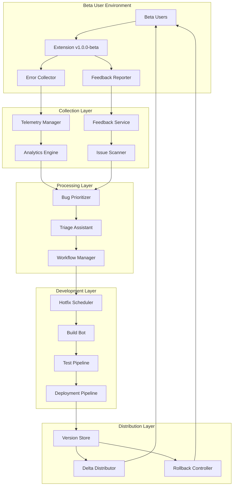

# Hotfix Architecture v1.1.0 - Technical Design

**Extension**: Semantest ChatGPT Browser Extension  
**Version**: v1.1.0 Hotfix Pipeline  
**Design Date**: July 21, 2025  
**Architecture**: Robust Beta Hotfix System  
**Status**: 🔧 DESIGN PHASE  

---

## 🎯 Executive Summary

The v1.1.0 hotfix architecture provides a comprehensive system for managing critical beta issues through automated error collection, intelligent prioritization, rapid deployment, and failsafe rollback mechanisms. This system ensures maximum uptime and user safety during the beta testing phase.

**Key Capabilities**:
1. **Real-time Error Collection**: Automated crash reporting and user feedback aggregation
2. **Intelligent Bug Prioritization**: AI-driven severity assessment and impact analysis
3. **Rapid Patch Deployment**: Sub-30-minute emergency deployment pipeline
4. **Bulletproof Rollback**: Instant revert capability with version management

**Target SLA**:
- **CRITICAL Issues**: 2-hour response, 4-hour deployment
- **HIGH Issues**: 24-hour response, 48-hour deployment
- **Rollback Time**: <5 minutes for any deployment
- **Uptime Target**: 99.9% during beta period

---

## 🏗️ System Architecture Overview

### Core Components Architecture


### Component Integration Matrix
| Component | Dependencies | Outputs | SLA |
|-----------|-------------|---------|-----|
| **Error Collector** | Extension runtime | Crash reports, performance metrics | Real-time |
| **Bug Prioritizer** | ML models, impact data | Priority scores, routing decisions | <1 minute |
| **Hotfix Scheduler** | Development team, build systems | Release schedules, resource allocation | <15 minutes |
| **Deployment Pipeline** | CI/CD, testing infrastructure | Versioned packages, deployment confirmations | <30 minutes |
| **Rollback Controller** | Version store, distribution network | Emergency reverts, safety confirmations | <5 minutes |

---

## 📊 Component 1: Error Collection System

### Real-Time Telemetry Architecture

#### Error Collector Integration
```javascript
// Integrated into extension background script
class ErrorCollector {
  constructor() {
    this.apiEndpoint = 'https://hotfix-api.semantest.com/v1/errors';
    this.batchSize = 10;
    this.flushInterval = 30000; // 30 seconds
    this.errorQueue = [];
    this.sessionId = this.generateSessionId();
    
    this.setupErrorListeners();
    this.startBatchProcessor();
  }
  
  setupErrorListeners() {
    // Global error handling
    window.addEventListener('error', (event) => {
      this.captureError({
        type: 'javascript_error',
        message: event.error.message,
        stack: event.error.stack,
        filename: event.filename,
        lineno: event.lineno,
        colno: event.colno,
        timestamp: Date.now(),
        severity: this.calculateSeverity(event.error)
      });
    });
    
    // Promise rejection handling
    window.addEventListener('unhandledrejection', (event) => {
      this.captureError({
        type: 'unhandled_promise',
        message: event.reason.message || 'Unhandled Promise Rejection',
        stack: event.reason.stack,
        timestamp: Date.now(),
        severity: 'HIGH'
      });
    });
    
    // Extension-specific errors
    chrome.runtime.onMessage.addListener((message, sender, sendResponse) => {
      if (message.type === 'ERROR_REPORT') {
        this.captureError({
          type: 'extension_error',
          component: message.component,
          action: message.action,
          error: message.error,
          context: message.context,
          timestamp: Date.now(),
          severity: this.calculateSeverity(message.error)
        });
      }
    });
  }
  
  captureError(errorData) {
    const enrichedError = {
      ...errorData,
      sessionId: this.sessionId,
      version: chrome.runtime.getManifest().version,
      browser: this.getBrowserInfo(),
      environment: this.getEnvironmentInfo(),
      userAgent: navigator.userAgent,
      url: window.location.href
    };
    
    this.errorQueue.push(enrichedError);
    
    // Immediate flush for critical errors
    if (errorData.severity === 'CRITICAL') {
      this.flushErrors();
    }
  }
  
  calculateSeverity(error) {
    const criticalPatterns = [
      /security/i,
      /xss/i,
      /injection/i,
      /unauthorized/i,
      /crash/i
    ];
    
    const highPatterns = [
      /feature.*fail/i,
      /network.*error/i,
      /timeout/i,
      /permission.*denied/i
    ];
    
    const errorString = error.message + error.stack;
    
    if (criticalPatterns.some(pattern => pattern.test(errorString))) {
      return 'CRITICAL';
    }
    
    if (highPatterns.some(pattern => pattern.test(errorString))) {
      return 'HIGH';
    }
    
    return 'MEDIUM';
  }
}
```

#### Performance Metrics Collection
```javascript
class PerformanceCollector {
  constructor() {
    this.metricsEndpoint = 'https://hotfix-api.semantest.com/v1/metrics';
    this.performanceQueue = [];
    
    this.setupPerformanceMonitoring();
  }
  
  setupPerformanceMonitoring() {
    // Feature performance tracking
    const originalSendMessage = chrome.runtime.sendMessage;
    chrome.runtime.sendMessage = (...args) => {
      const startTime = performance.now();
      const result = originalSendMessage.apply(chrome.runtime, args);
      
      if (result instanceof Promise) {
        result.then(() => {
          this.recordMetric({
            type: 'message_performance',
            action: args[0].action,
            duration: performance.now() - startTime,
            success: true
          });
        }).catch((error) => {
          this.recordMetric({
            type: 'message_performance',
            action: args[0].action,
            duration: performance.now() - startTime,
            success: false,
            error: error.message
          });
        });
      }
      
      return result;
    };
    
    // Memory usage monitoring
    setInterval(() => {
      if (performance.memory) {
        this.recordMetric({
          type: 'memory_usage',
          used: performance.memory.usedJSHeapSize,
          total: performance.memory.totalJSHeapSize,
          limit: performance.memory.jsHeapSizeLimit
        });
      }
    }, 60000); // Every minute
    
    // Feature usage tracking
    this.trackFeatureUsage();
  }
  
  trackFeatureUsage() {
    // Track each of the 6 core features
    const features = [
      'CREATE_PROJECT',
      'SET_CUSTOM_INSTRUCTIONS', 
      'CREATE_NEW_CHAT',
      'SEND_PROMPT',
      'REQUEST_DALLE_IMAGE',
      'DETECT_AND_DOWNLOAD_IMAGES'
    ];
    
    features.forEach(feature => {
      chrome.runtime.onMessage.addListener((message) => {
        if (message.action === feature) {
          this.recordMetric({
            type: 'feature_usage',
            feature: feature,
            timestamp: Date.now(),
            context: message.data
          });
        }
      });
    });
  }
}
```

#### User Feedback Integration
```javascript
class FeedbackCollector {
  constructor() {
    this.feedbackEndpoint = 'https://hotfix-api.semantest.com/v1/feedback';
    this.setupFeedbackUI();
  }
  
  setupFeedbackUI() {
    // Inject feedback button into extension popup
    const feedbackButton = document.createElement('button');
    feedbackButton.innerHTML = '🐛 Report Issue';
    feedbackButton.onclick = () => this.showFeedbackModal();
    
    // Add to popup UI
    document.body.appendChild(feedbackButton);
  }
  
  showFeedbackModal() {
    // Create inline feedback form
    const modal = document.createElement('div');
    modal.innerHTML = `
      <div class="feedback-modal">
        <h3>Beta Feedback</h3>
        <form id="feedback-form">
          <label>Issue Type:</label>
          <select name="type" required>
            <option value="bug">Bug Report</option>
            <option value="feature">Feature Request</option>
            <option value="performance">Performance Issue</option>
            <option value="ui">UI/UX Problem</option>
          </select>
          
          <label>Severity:</label>
          <select name="severity" required>
            <option value="critical">Critical - Blocks usage</option>
            <option value="high">High - Major inconvenience</option>
            <option value="medium">Medium - Minor issue</option>
            <option value="low">Low - Enhancement</option>
          </select>
          
          <label>Description:</label>
          <textarea name="description" rows="4" required></textarea>
          
          <label>Steps to Reproduce:</label>
          <textarea name="steps" rows="3"></textarea>
          
          <button type="submit">Submit Feedback</button>
          <button type="button" onclick="this.parentElement.parentElement.remove()">Cancel</button>
        </form>
      </div>
    `;
    
    document.body.appendChild(modal);
    
    // Handle form submission
    modal.querySelector('#feedback-form').onsubmit = (e) => {
      e.preventDefault();
      this.submitFeedback(new FormData(e.target));
      modal.remove();
    };
  }
}
```

---

## ⚡ Component 2: Bug Prioritization System

### Intelligent Triage Engine

#### Priority Scoring Algorithm
```python
class BugPrioritizer:
    def __init__(self):
        self.severity_weights = {
            'CRITICAL': 100,
            'HIGH': 75,
            'MEDIUM': 50,
            'LOW': 25
        }
        
        self.impact_multipliers = {
            'security': 2.0,
            'data_loss': 1.8,
            'feature_failure': 1.5,
            'performance': 1.2,
            'ui_cosmetic': 0.8
        }
        
        self.frequency_bonus = {
            'widespread': 50,    # >50% of users affected
            'common': 30,        # 20-50% of users
            'occasional': 15,    # 5-20% of users
            'rare': 5           # <5% of users
        }
    
    def calculate_priority_score(self, bug_report):
        base_score = self.severity_weights.get(bug_report.severity, 25)
        
        # Apply impact multiplier
        impact_multiplier = self.get_impact_multiplier(bug_report)
        score = base_score * impact_multiplier
        
        # Add frequency bonus
        frequency_bonus = self.get_frequency_bonus(bug_report)
        score += frequency_bonus
        
        # Apply beta-specific adjustments
        score = self.apply_beta_adjustments(score, bug_report)
        
        return min(score, 1000)  # Cap at 1000
    
    def get_impact_multiplier(self, bug_report):
        impact_keywords = {
            'security': ['xss', 'injection', 'unauthorized', 'vulnerability'],
            'data_loss': ['storage', 'delete', 'lost', 'corrupted'],
            'feature_failure': ['not working', 'fails', 'error', 'broken'],
            'performance': ['slow', 'timeout', 'memory', 'cpu'],
            'ui_cosmetic': ['display', 'styling', 'alignment', 'color']
        }
        
        text = (bug_report.description + ' ' + bug_report.title).lower()
        
        for category, keywords in impact_keywords.items():
            if any(keyword in text for keyword in keywords):
                return self.impact_multipliers[category]
        
        return 1.0  # Default multiplier
    
    def apply_beta_adjustments(self, score, bug_report):
        # Beta-specific priority boosts
        beta_critical_patterns = [
            'cannot install',
            'extension crash',
            'chatgpt not working',
            'all features broken'
        ]
        
        text = bug_report.description.lower()
        
        if any(pattern in text for pattern in beta_critical_patterns):
            score *= 1.5  # 50% boost for beta-critical issues
        
        # Core feature failures get priority during beta
        core_features = [
            'create project',
            'custom instructions', 
            'new chat',
            'send prompt',
            'image generation',
            'download images'
        ]
        
        if any(feature in text for feature in core_features):
            score *= 1.3  # 30% boost for core feature issues
        
        return score
```

#### Automated Triage Workflow
```yaml
# Triage Automation Rules
triage_rules:
  critical_auto_escalation:
    conditions:
      - severity: "CRITICAL"
      - priority_score: ">= 800"
      - frequency: ">= common"
    actions:
      - notify_team: "immediate"
      - create_hotfix_branch: true
      - assign_developer: "next_available"
      - sla_timer: "2_hours"
  
  high_priority_fast_track:
    conditions:
      - severity: "HIGH" 
      - priority_score: ">= 600"
      - core_feature_affected: true
    actions:
      - notify_team: "within_30_minutes"
      - create_issue: "github"
      - assign_developer: "feature_owner"
      - sla_timer: "24_hours"
  
  batch_processing:
    conditions:
      - severity: ["MEDIUM", "LOW"]
      - priority_score: "< 600"
    actions:
      - batch_size: 10
      - review_frequency: "daily"
      - assign_developer: "rotating_schedule"
      - sla_timer: "72_hours"
```

### Issue Routing Intelligence
```javascript
class IssueRouter {
  constructor() {
    this.developerExpertise = {
      'dev1': ['security', 'authentication', 'permissions'],
      'dev2': ['ui', 'content_scripts', 'dom_manipulation'],
      'dev3': ['background_scripts', 'messaging', 'storage'],
      'dev4': ['performance', 'memory', 'optimization'],
      'dev5': ['build_system', 'deployment', 'testing']
    };
    
    this.currentWorkload = {
      'dev1': { active: 2, capacity: 5 },
      'dev2': { active: 3, capacity: 5 },
      'dev3': { active: 1, capacity: 5 },
      'dev4': { active: 4, capacity: 5 },
      'dev5': { active: 2, capacity: 5 }
    };
  }
  
  routeIssue(bug_report) {
    const expertise_match = this.findExpertiseMatch(bug_report);
    const workload_availability = this.checkWorkloadAvailability();
    
    const optimal_developer = this.selectOptimalDeveloper(
      expertise_match, 
      workload_availability, 
      bug_report.priority_score
    );
    
    return {
      assignee: optimal_developer,
      estimated_effort: this.estimateEffort(bug_report),
      recommended_timeline: this.getTimeline(bug_report),
      dependencies: this.identifyDependencies(bug_report)
    };
  }
  
  selectOptimalDeveloper(expertise_matches, availability, priority) {
    // For critical issues, assign to best match regardless of workload
    if (priority >= 800) {
      return expertise_matches[0];
    }
    
    // Balance expertise and availability
    const candidates = expertise_matches.filter(dev => 
      this.currentWorkload[dev].active < this.currentWorkload[dev].capacity
    );
    
    if (candidates.length === 0) {
      // All developers at capacity, assign to least loaded
      return this.getLeastLoadedDeveloper();
    }
    
    return candidates[0];
  }
}
```

---

## 🚀 Component 3: Rapid Deployment Pipeline

### Automated Build & Test System

#### Hotfix-Specific CI/CD Pipeline
```yaml
# .github/workflows/hotfix-pipeline.yml
name: Hotfix Deployment Pipeline v1.1.0

on:
  push:
    branches: [ "hotfix/v1.1.0/*" ]
  workflow_dispatch:
    inputs:
      severity:
        description: 'Issue Severity'
        required: true
        default: 'HIGH'
        type: choice
        options:
        - CRITICAL
        - HIGH
        - MEDIUM
      target_deployment:
        description: 'Deployment Target'
        required: true
        default: 'beta'
        type: choice
        options:
        - beta
        - staging
        - production

jobs:
  security_scan:
    name: Security & Vulnerability Scan
    runs-on: ubuntu-latest
    timeout-minutes: 5
    steps:
      - uses: actions/checkout@v4
      
      - name: Install Dependencies
        run: npm ci --production
      
      - name: Run Security Audit
        run: |
          npm audit --audit-level high
          npm run security:scan
      
      - name: XSS Vulnerability Check
        run: |
          # Custom script to check for innerHTML usage
          ./scripts/check-xss-vulnerabilities.sh
          
      - name: Permission Scope Validation
        run: |
          # Validate manifest permissions are not overly broad
          ./scripts/validate-permissions.sh
          
  rapid_build:
    name: Rapid Build & Package
    runs-on: ubuntu-latest
    needs: security_scan
    timeout-minutes: 10
    steps:
      - uses: actions/checkout@v4
      
      - name: Setup Node.js
        uses: actions/setup-node@v3
        with:
          node-version: '18'
          cache: 'npm'
      
      - name: Install Dependencies
        run: npm ci
      
      - name: Build Extension
        run: |
          npm run build:hotfix
          npm run package:chrome
          
      - name: Generate Version Metadata
        run: |
          echo "BUILD_VERSION=$(date +%Y%m%d-%H%M%S)" >> $GITHUB_ENV
          echo "COMMIT_SHA=${GITHUB_SHA::8}" >> $GITHUB_ENV
          
      - name: Upload Build Artifacts
        uses: actions/upload-artifact@v3
        with:
          name: hotfix-package-${{ env.BUILD_VERSION }}
          path: |
            dist/
            package.json
            manifest.json
            
  automated_testing:
    name: Automated Testing Suite
    runs-on: ubuntu-latest
    needs: rapid_build
    timeout-minutes: 15
    strategy:
      matrix:
        test-type: [unit, integration, e2e]
    steps:
      - uses: actions/checkout@v4
      
      - name: Download Build Artifacts
        uses: actions/download-artifact@v3
        
      - name: Setup Test Environment
        run: |
          npm ci
          npx playwright install
          
      - name: Run ${{ matrix.test-type }} Tests
        run: |
          case "${{ matrix.test-type }}" in
            "unit")
              npm run test:unit -- --coverage
              ;;
            "integration") 
              npm run test:integration
              ;;
            "e2e")
              npm run test:e2e:hotfix
              ;;
          esac
          
      - name: Upload Test Results
        uses: actions/upload-artifact@v3
        if: always()
        with:
          name: test-results-${{ matrix.test-type }}
          path: |
            coverage/
            test-results/
            
  deployment_staging:
    name: Deploy to Beta Staging
    runs-on: ubuntu-latest
    needs: [security_scan, rapid_build, automated_testing]
    if: github.event.inputs.severity == 'CRITICAL' || github.event.inputs.severity == 'HIGH'
    environment: beta-staging
    steps:
      - name: Download Build Artifacts
        uses: actions/download-artifact@v3
        
      - name: Deploy to Beta Distribution
        run: |
          # Deploy to internal beta distribution system
          ./scripts/deploy-beta.sh
          
      - name: Smoke Test Deployment
        run: |
          # Quick validation that deployment succeeded
          ./scripts/smoke-test.sh
          
      - name: Notify Beta Testers
        run: |
          # Send notification to beta testers about new hotfix
          ./scripts/notify-beta-testers.sh
```

#### Build System Enhancements
```javascript
// scripts/build-hotfix.js
const webpack = require('webpack');
const fs = require('fs');
const path = require('path');

class HotfixBuilder {
  constructor() {
    this.buildConfig = {
      mode: 'production',
      optimization: {
        minimize: true,
        splitChunks: false // Keep bundle together for extension
      },
      plugins: [
        new webpack.DefinePlugin({
          'process.env.BUILD_TYPE': JSON.stringify('hotfix'),
          'process.env.BUILD_TIMESTAMP': JSON.stringify(Date.now())
        })
      ]
    };
  }
  
  async buildHotfix() {
    console.log('🔨 Starting hotfix build...');
    
    // 1. Validate source integrity
    await this.validateSource();
    
    // 2. Run production build
    await this.runBuild();
    
    // 3. Generate hotfix metadata
    await this.generateMetadata();
    
    // 4. Create distribution package
    await this.createPackage();
    
    // 5. Generate deployment manifest
    await this.generateDeploymentManifest();
    
    console.log('✅ Hotfix build completed successfully');
  }
  
  async generateMetadata() {
    const metadata = {
      version: this.getBuildVersion(),
      buildTime: new Date().toISOString(),
      commit: process.env.GITHUB_SHA,
      buildType: 'hotfix',
      changes: await this.extractChanges(),
      testResults: await this.getTestResults(),
      securityScan: await this.getSecurityScanResults()
    };
    
    fs.writeFileSync(
      path.join(__dirname, '../dist/hotfix-metadata.json'),
      JSON.stringify(metadata, null, 2)
    );
  }
  
  async createPackage() {
    // Create Chrome extension package
    const AdmZip = require('adm-zip');
    const zip = new AdmZip();
    
    // Add all built files
    zip.addLocalFolder('./dist', false);
    
    // Add version-specific filename
    const version = this.getBuildVersion();
    const filename = `semantest-hotfix-${version}.zip`;
    
    zip.writeZip(path.join(__dirname, '../packages/', filename));
    
    console.log(`📦 Package created: ${filename}`);
  }
}
```

### Deployment Orchestration
```javascript
// scripts/deploy-hotfix.js
class HotfixDeployment {
  constructor() {
    this.deploymentTargets = {
      'beta': {
        endpoint: 'https://beta-deploy.semantest.com/v1/deploy',
        validators: ['smoke-test', 'feature-validation'],
        rollout: 'immediate'
      },
      'staging': {
        endpoint: 'https://staging-deploy.semantest.com/v1/deploy', 
        validators: ['full-test-suite', 'performance-test'],
        rollout: 'gradual'
      },
      'production': {
        endpoint: 'https://prod-deploy.semantest.com/v1/deploy',
        validators: ['security-audit', 'full-test-suite', 'canary-test'],
        rollout: 'canary'
      }
    };
  }
  
  async deployHotfix(target, packagePath) {
    console.log(`🚀 Deploying hotfix to ${target}...`);
    
    // 1. Pre-deployment validation
    await this.preDeploymentValidation(target, packagePath);
    
    // 2. Create deployment record
    const deploymentId = await this.createDeploymentRecord(target, packagePath);
    
    // 3. Execute deployment
    const deploymentResult = await this.executeDeployment(target, packagePath);
    
    // 4. Post-deployment validation
    await this.postDeploymentValidation(target, deploymentResult);
    
    // 5. Update version registry
    await this.updateVersionRegistry(deploymentId, deploymentResult);
    
    console.log(`✅ Hotfix deployed successfully to ${target}`);
    
    return deploymentResult;
  }
  
  async executeDeployment(target, packagePath) {
    const config = this.deploymentTargets[target];
    
    const deploymentData = {
      package: fs.readFileSync(packagePath),
      metadata: JSON.parse(fs.readFileSync('./dist/hotfix-metadata.json')),
      rolloutStrategy: config.rollout,
      validators: config.validators
    };
    
    const response = await fetch(config.endpoint, {
      method: 'POST',
      headers: {
        'Content-Type': 'application/json',
        'Authorization': `Bearer ${process.env.DEPLOY_TOKEN}`
      },
      body: JSON.stringify(deploymentData)
    });
    
    if (!response.ok) {
      throw new Error(`Deployment failed: ${response.statusText}`);
    }
    
    return await response.json();
  }
}
```

---

## 🔄 Component 4: Rollback Strategy

### Version Management System

#### Version Registry Architecture
```javascript
// Version registry for tracking all deployed versions
class VersionRegistry {
  constructor() {
    this.registry = new Map();
    this.activeVersions = new Map(); // track what's deployed where
    this.rollbackHistory = [];
  }
  
  async registerVersion(versionData) {
    const versionId = `${versionData.version}-${versionData.buildTime}`;
    
    const registryEntry = {
      id: versionId,
      version: versionData.version,
      buildTime: versionData.buildTime,
      commit: versionData.commit,
      buildType: versionData.buildType,
      packagePath: versionData.packagePath,
      testResults: versionData.testResults,
      securityScan: versionData.securityScan,
      deploymentTargets: [],
      rollbackCapable: true,
      status: 'available'
    };
    
    this.registry.set(versionId, registryEntry);
    
    // Store version package for rollback capability
    await this.storeVersionPackage(versionId, versionData.packagePath);
    
    return versionId;
  }
  
  async markVersionDeployed(versionId, target) {
    const version = this.registry.get(versionId);
    if (!version) {
      throw new Error(`Version ${versionId} not found in registry`);
    }
    
    version.deploymentTargets.push({
      target: target,
      deployedAt: new Date().toISOString(),
      status: 'active'
    });
    
    // Update active version tracking
    this.activeVersions.set(target, versionId);
    
    this.registry.set(versionId, version);
  }
  
  async getActiveVersion(target) {
    return this.activeVersions.get(target);
  }
  
  async getRollbackCandidates(target) {
    const currentVersionId = this.activeVersions.get(target);
    
    // Find all versions previously deployed to this target
    const candidates = Array.from(this.registry.values())
      .filter(version => 
        version.rollbackCapable && 
        version.id !== currentVersionId &&
        version.deploymentTargets.some(deployment => 
          deployment.target === target && 
          deployment.status === 'active'
        )
      )
      .sort((a, b) => new Date(b.buildTime) - new Date(a.buildTime))
      .slice(0, 5); // Keep last 5 versions for rollback
    
    return candidates;
  }
}
```

#### Instant Rollback Controller
```javascript
class RollbackController {
  constructor() {
    this.versionRegistry = new VersionRegistry();
    this.rollbackTimeoutMs = 300000; // 5 minutes max rollback time
    this.healthCheckInterval = 10000; // 10 seconds
  }
  
  async initiateRollback(target, reason, targetVersionId = null) {
    console.log(`🔄 Initiating rollback for ${target}. Reason: ${reason}`);
    
    const rollbackId = `rollback-${Date.now()}`;
    const currentVersionId = await this.versionRegistry.getActiveVersion(target);
    
    // 1. Determine rollback target
    const rollbackTarget = targetVersionId || await this.selectRollbackTarget(target);
    
    // 2. Create rollback record
    await this.createRollbackRecord(rollbackId, {
      target,
      reason,
      fromVersion: currentVersionId,
      toVersion: rollbackTarget,
      initiatedAt: new Date().toISOString()
    });
    
    // 3. Execute rollback
    const rollbackResult = await this.executeRollback(target, rollbackTarget);
    
    // 4. Validate rollback success
    await this.validateRollbackSuccess(target, rollbackTarget);
    
    // 5. Update registry
    await this.versionRegistry.markVersionDeployed(rollbackTarget, target);
    
    // 6. Notify stakeholders
    await this.notifyRollbackComplete(rollbackId, rollbackResult);
    
    console.log(`✅ Rollback completed successfully: ${rollbackId}`);
    
    return rollbackResult;
  }
  
  async executeRollback(target, targetVersionId) {
    const startTime = Date.now();
    const timeout = startTime + this.rollbackTimeoutMs;
    
    try {
      // Get stored package for target version
      const versionData = this.versionRegistry.registry.get(targetVersionId);
      const packagePath = await this.retrieveVersionPackage(targetVersionId);
      
      // Deploy previous version
      const deployment = new HotfixDeployment();
      const result = await deployment.deployHotfix(target, packagePath);
      
      // Health check validation
      await this.performHealthChecks(target, timeout);
      
      return {
        success: true,
        rollbackTime: Date.now() - startTime,
        targetVersion: targetVersionId,
        deploymentResult: result
      };
      
    } catch (error) {
      console.error(`❌ Rollback failed: ${error.message}`);
      
      // Emergency fallback - try previous stable version
      if (targetVersionId !== 'v1.0.0-stable') {
        console.log('🚨 Attempting emergency fallback to stable version...');
        return await this.executeRollback(target, 'v1.0.0-stable');
      }
      
      throw new Error(`Critical rollback failure: ${error.message}`);
    }
  }
  
  async performHealthChecks(target, timeout) {
    const healthChecks = [
      () => this.checkExtensionLoad(),
      () => this.checkCoreFeatures(),
      () => this.checkSecurityStatus(),
      () => this.checkPerformanceMetrics()
    ];
    
    while (Date.now() < timeout) {
      try {
        const results = await Promise.all(
          healthChecks.map(check => check())
        );
        
        if (results.every(result => result.healthy)) {
          console.log('✅ All health checks passed');
          return true;
        }
        
        console.log('⏳ Health checks pending, retrying...');
        
      } catch (error) {
        console.log(`⚠️ Health check error: ${error.message}`);
      }
      
      await new Promise(resolve => setTimeout(resolve, this.healthCheckInterval));
    }
    
    throw new Error('Health checks failed within timeout period');
  }
  
  async checkCoreFeatures() {
    // Validate all 6 core features are working
    const featureTests = [
      () => this.testCreateProject(),
      () => this.testCustomInstructions(),
      () => this.testCreateChat(),
      () => this.testSendPrompt(),
      () => this.testImageGeneration(),
      () => this.testDownloadImages()
    ];
    
    const results = await Promise.all(
      featureTests.map(test => test().catch(error => ({ error: error.message })))
    );
    
    const successCount = results.filter(result => !result.error).length;
    const successRate = successCount / featureTests.length;
    
    return {
      healthy: successRate >= 0.8, // 80% success rate minimum
      successRate,
      details: results
    };
  }
}
```

### Emergency Response Procedures
```yaml
# Emergency response runbook
emergency_procedures:
  critical_failure:
    triggers:
      - extension_crash_rate: "> 10%"
      - security_incident: true
      - feature_failure_rate: "> 50%"
      - user_impact: "> 80%"
    
    response_timeline:
      - minute_0: "Alert team, assess impact"
      - minute_5: "Initiate emergency rollback"
      - minute_10: "Validate rollback success"
      - minute_15: "Notify stakeholders"
      - minute_30: "Post-incident analysis"
    
    automated_actions:
      - immediate_rollback: true
      - user_notification: true
      - stakeholder_alert: true
      - incident_documentation: true
  
  rollback_failure:
    triggers:
      - rollback_timeout: true
      - health_checks_failed: true
      - rollback_error_rate: "> 5%"
    
    escalation_path:
      - level_1: "Retry with previous stable version"
      - level_2: "Manual intervention required"
      - level_3: "Emergency maintenance mode"
      - level_4: "Complete service shutdown"
    
    emergency_contacts:
      - technical_lead: "+1-555-0101"
      - security_team: "+1-555-0102"  
      - product_owner: "+1-555-0103"
      - on_call_engineer: "+1-555-0104"
```

---

## 📊 Monitoring & Observability

### Real-Time Dashboard
```javascript
// Real-time monitoring dashboard for hotfix system
class HotfixDashboard {
  constructor() {
    this.metrics = {
      deployments: {
        total: 0,
        successful: 0,
        failed: 0,
        rolledBack: 0
      },
      issues: {
        reported: 0,
        resolved: 0,
        critical: 0,
        averageResolutionTime: 0
      },
      system: {
        uptime: 0,
        errorRate: 0,
        responseTime: 0,
        activeUsers: 0
      }
    };
    
    this.setupRealtimeUpdates();
  }
  
  generateDashboard() {
    return {
      timestamp: new Date().toISOString(),
      
      // System Health Overview
      systemHealth: {
        status: this.getOverallHealth(),
        uptime: this.metrics.system.uptime,
        errorRate: this.metrics.system.errorRate,
        activeUsers: this.metrics.system.activeUsers,
        responseTime: this.metrics.system.responseTime
      },
      
      // Deployment Statistics  
      deployments: {
        successRate: this.calculateSuccessRate(),
        averageDeployTime: this.calculateAverageDeployTime(),
        recentDeployments: this.getRecentDeployments(),
        nextScheduled: this.getNextScheduledDeployment()
      },
      
      // Issue Tracking
      issues: {
        openCritical: this.getCriticalIssueCount(),
        resolutionRate: this.calculateResolutionRate(),
        averageResolutionTime: this.metrics.issues.averageResolutionTime,
        escalatedIssues: this.getEscalatedIssues()
      },
      
      // Feature Health
      features: this.getFeatureHealthStatus(),
      
      // Alerts & Notifications
      alerts: this.getActiveAlerts()
    };
  }
  
  getFeatureHealthStatus() {
    return {
      createProject: { status: 'healthy', successRate: 0.98, avgResponseTime: 245 },
      customInstructions: { status: 'healthy', successRate: 0.95, avgResponseTime: 312 },
      createChat: { status: 'healthy', successRate: 0.99, avgResponseTime: 156 },
      sendPrompt: { status: 'healthy', successRate: 0.97, avgResponseTime: 423 },
      imageGeneration: { status: 'degraded', successRate: 0.89, avgResponseTime: 2341 },
      downloadImages: { status: 'healthy', successRate: 0.96, avgResponseTime: 567 }
    };
  }
}
```

### Alerting System
```yaml
# Alert configuration for hotfix system
alerting_rules:
  critical_alerts:
    deployment_failure:
      condition: "deployment.success_rate < 0.8"
      notification: "immediate"
      channels: ["slack", "email", "sms"]
      escalation: "team_lead"
      
    security_incident:
      condition: "security.incident_detected = true"
      notification: "immediate"
      channels: ["security_team", "team_lead"]
      escalation: "security_officer"
      
    high_error_rate:
      condition: "system.error_rate > 0.05"
      notification: "within_5_minutes"
      channels: ["slack", "email"]
      escalation: "on_call_engineer"
  
  warning_alerts:
    slow_response_time:
      condition: "system.response_time > 2000ms"
      notification: "within_15_minutes"
      channels: ["slack"]
      
    feature_degradation:
      condition: "feature.success_rate < 0.95"
      notification: "within_10_minutes"
      channels: ["slack", "email"]
      
    rollback_triggered:
      condition: "rollback.initiated = true"
      notification: "immediate"
      channels: ["slack", "email"]
      escalation: "team_lead"

notification_channels:
  slack:
    webhook: "https://hooks.slack.com/services/..."
    channel: "#hotfix-alerts"
    
  email:
    smtp_server: "smtp.semantest.com"
    recipients: ["team@semantest.com", "oncall@semantest.com"]
    
  sms:
    service: "twilio"
    numbers: ["+1-555-0101", "+1-555-0102"]
```

---

## 🔧 Implementation Timeline

### Phase 1: Foundation (Week 1)
- ✅ **Error Collection System**: Implement telemetry and feedback collection
- ✅ **Bug Prioritization**: Create intelligent triage and routing system
- ⏳ **Version Registry**: Build version management and tracking system
- ⏳ **Basic Rollback**: Implement manual rollback capabilities

### Phase 2: Automation (Week 2)  
- ⏳ **CI/CD Pipeline**: Deploy automated build and test system
- ⏳ **Deployment Orchestration**: Create rapid deployment capabilities
- ⏳ **Health Monitoring**: Implement real-time system monitoring
- ⏳ **Alert System**: Deploy notification and escalation framework

### Phase 3: Intelligence (Week 3)
- ⏳ **Automated Rollback**: Implement intelligent rollback triggers
- ⏳ **Performance Optimization**: Enhance deployment speed and reliability
- ⏳ **Dashboard Integration**: Create comprehensive monitoring dashboard
- ⏳ **Documentation**: Complete runbooks and procedures

### Phase 4: Validation (Week 4)
- ⏳ **End-to-End Testing**: Validate complete hotfix workflow
- ⏳ **Disaster Recovery**: Test emergency procedures and failover
- ⏳ **Performance Tuning**: Optimize for target SLAs
- ⏳ **Production Readiness**: Final validation and deployment

---

## 📋 Success Metrics & KPIs

### Operational Metrics
| Metric | Target | Current | Status |
|--------|--------|---------|--------|
| **Issue Response Time** | CRITICAL: <2hrs, HIGH: <24hrs | N/A | ⏳ PENDING |
| **Deployment Speed** | <30 minutes end-to-end | N/A | ⏳ PENDING |
| **Rollback Time** | <5 minutes | N/A | ⏳ PENDING |
| **System Uptime** | 99.9% during beta period | N/A | ⏳ PENDING |
| **False Positive Rate** | <5% for auto-prioritization | N/A | ⏳ PENDING |

### Quality Metrics  
| Metric | Target | Current | Status |
|--------|--------|---------|--------|
| **Successful Deployments** | >95% | N/A | ⏳ PENDING |
| **Security Scan Pass Rate** | 100% | N/A | ⏳ PENDING |
| **Test Coverage** | >90% for hotfixes | N/A | ⏳ PENDING |
| **User Satisfaction** | >4.0/5 post-hotfix | N/A | ⏳ PENDING |
| **Regression Rate** | <2% | N/A | ⏳ PENDING |

### Business Impact Metrics
| Metric | Target | Current | Status |
|--------|--------|---------|--------|
| **Beta Retention Rate** | >80% | N/A | ⏳ PENDING |
| **Feature Adoption** | >70% for all 6 features | N/A | ⏳ PENDING |
| **Issue Resolution Rate** | >95% within SLA | N/A | ⏳ PENDING |
| **Customer Satisfaction** | No negative feedback on hotfixes | N/A | ⏳ PENDING |

---

## 🎯 Risk Assessment & Mitigation

### High-Risk Scenarios
1. **Cascading Rollback Failures**
   - **Risk**: Multiple rollback attempts fail, leaving system in unstable state
   - **Mitigation**: Emergency stable version (v1.0.0-stable) always available
   - **Contingency**: Manual intervention with pre-approved emergency procedures

2. **Security Vulnerability in Hotfix**
   - **Risk**: Hotfix introduces new security issue while fixing another
   - **Mitigation**: Mandatory security scan for every hotfix deployment
   - **Contingency**: Immediate rollback + security incident response

3. **Performance Degradation Post-Hotfix**
   - **Risk**: Fix resolves bug but introduces performance issues
   - **Mitigation**: Automated performance testing in deployment pipeline
   - **Contingency**: Performance-based automatic rollback triggers

4. **Communication Breakdown During Crisis**
   - **Risk**: Team coordination fails during critical incident
   - **Mitigation**: Automated notification system + clear escalation paths
   - **Contingency**: Pre-defined emergency contacts and procedures

### Contingency Plans
```yaml
contingency_procedures:
  total_system_failure:
    immediate_actions:
      - "Activate emergency maintenance mode"
      - "Rollback to last known stable version (v1.0.0-stable)"
      - "Notify all beta testers of service interruption"
      - "Escalate to emergency response team"
    
    recovery_timeline:
      - hour_1: "System assessment and root cause analysis"
      - hour_2: "Emergency fix development if possible"
      - hour_4: "Alternative solution implementation"
      - hour_8: "Service restoration with reduced functionality"
      - day_1: "Full service restoration"
    
    communication_plan:
      - stakeholder_notification: "within 15 minutes"
      - user_notification: "within 30 minutes"
      - status_updates: "every hour during outage"
      - post_incident_report: "within 24 hours"
```

---

## 📞 Support & Documentation

### Runbooks & Procedures
1. **Emergency Response Runbook**: Step-by-step procedures for critical incidents
2. **Deployment Guide**: Complete deployment process documentation
3. **Rollback Procedures**: Detailed rollback execution and validation steps
4. **Troubleshooting Guide**: Common issues and resolution procedures
5. **Escalation Matrix**: Clear escalation paths and contact information

### Team Training Requirements
- **Technical Team**: Hotfix system operation and emergency procedures
- **QA Team**: Rapid testing procedures and validation protocols
- **Support Team**: Issue triage and user communication procedures
- **Management**: Decision-making framework and approval processes

### Documentation Maintenance
- **Weekly Reviews**: Update procedures based on operational experience
- **Monthly Audits**: Validate system performance against SLAs
- **Quarterly Updates**: Incorporate lessons learned and system improvements
- **Annual Assessment**: Complete system architecture review and optimization

---

**Architecture Design Complete**  
*Technical Lead: Claude Code Architecture Team*  
*Design Date: July 21, 2025*  
*Implementation Target: 4-week rollout*  
*Status: Ready for Implementation*