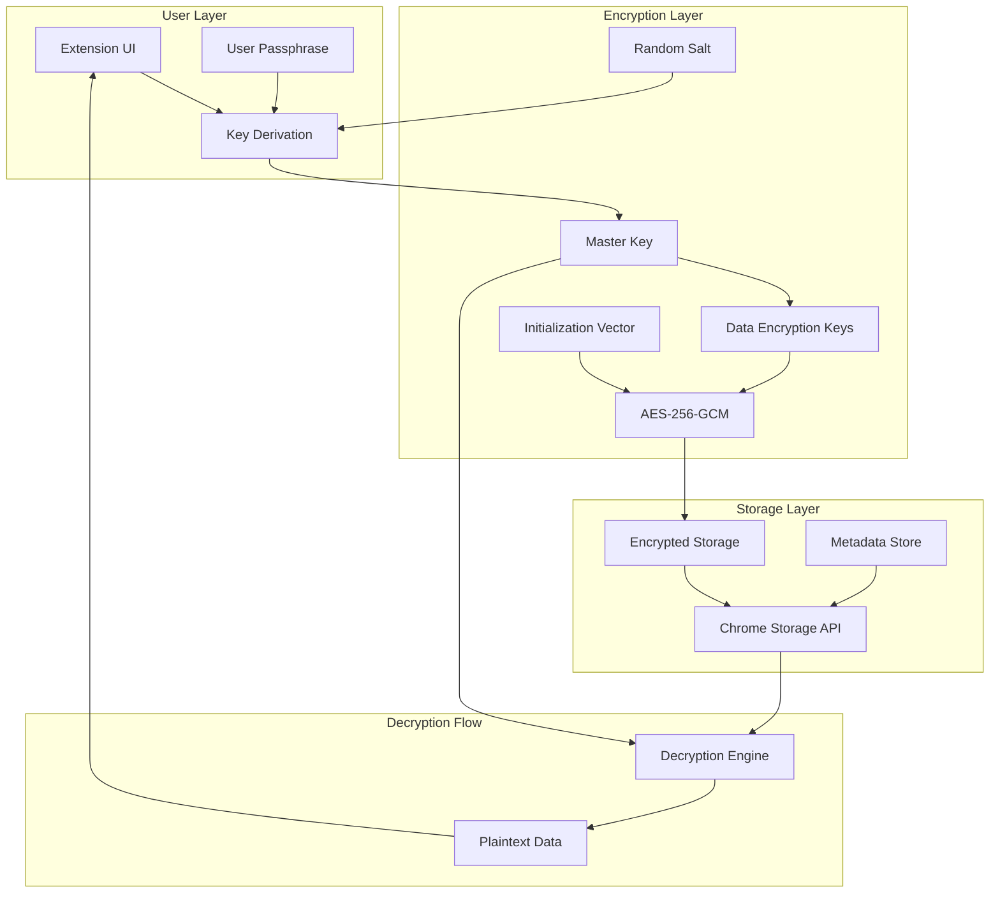

# Secure Storage Architecture - Data Encryption Design

**Extension**: Semantest ChatGPT Browser Extension  
**Version**: v1.1.0 Security Enhancement  
**Architecture**: End-to-End Encryption for Sensitive Data  
**Design Date**: July 21, 2025  
**Priority**: 🚨 CRITICAL - Security Vulnerability Fix  

---

## 🎯 Executive Summary

This architecture addresses the critical security vulnerability of unencrypted storage in the ChatGPT extension. The design provides military-grade encryption for sensitive user data while maintaining performance and usability.

**Key Security Enhancements**:
1. **AES-256-GCM encryption** for all sensitive data
2. **Secure key derivation** using PBKDF2
3. **Zero-knowledge architecture** - keys never leave client
4. **Automatic encryption** for custom instructions and patterns
5. **Secure memory handling** to prevent data leaks

**Compliance**: GDPR, CCPA, Chrome Web Store Security Requirements

---

## 🏗️ Architecture Overview

### Encryption Flow Architecture


### Data Classification & Encryption Requirements
| Data Type | Sensitivity | Encryption | Storage Location |
|-----------|------------|------------|------------------|
| **Custom Instructions** | HIGH | AES-256-GCM | Encrypted Local |
| **Automation Patterns** | HIGH | AES-256-GCM | Encrypted Local |
| **Project Names** | MEDIUM | AES-256-GCM | Encrypted Local |
| **User Preferences** | LOW | Optional | Local Storage |
| **Feature Usage Stats** | LOW | None | Local Storage |
| **Error Logs** | MEDIUM | Obfuscated | Session Only |

---

## 🔐 Component 1: Encryption Service

### Core Encryption Implementation
```javascript
// src/security/encryption-service.js
class EncryptionService {
  constructor() {
    this.algorithm = 'AES-GCM';
    this.keyLength = 256;
    this.saltLength = 32;
    this.ivLength = 16;
    this.tagLength = 128;
    this.pbkdf2Iterations = 100000;
    
    this.masterKey = null;
    this.isInitialized = false;
  }
  
  /**
   * Initialize encryption with user-provided passphrase
   * @param {string} passphrase - User's passphrase (never stored)
   */
  async initialize(passphrase) {
    try {
      // Generate or retrieve salt
      const salt = await this.getOrCreateSalt();
      
      // Derive master key from passphrase
      this.masterKey = await this.deriveMasterKey(passphrase, salt);
      
      // Clear passphrase from memory
      this.secureWipe(passphrase);
      
      // Validate initialization
      await this.validateInitialization();
      
      this.isInitialized = true;
      
      // Set up automatic cleanup
      this.setupMemoryCleanup();
      
    } catch (error) {
      this.handleInitializationError(error);
      throw new Error('Encryption initialization failed');
    }
  }
  
  /**
   * Derive master key using PBKDF2
   */
  async deriveMasterKey(passphrase, salt) {
    const encoder = new TextEncoder();
    const passphraseKey = await crypto.subtle.importKey(
      'raw',
      encoder.encode(passphrase),
      'PBKDF2',
      false,
      ['deriveBits', 'deriveKey']
    );
    
    return await crypto.subtle.deriveKey(
      {
        name: 'PBKDF2',
        salt: salt,
        iterations: this.pbkdf2Iterations,
        hash: 'SHA-256'
      },
      passphraseKey,
      {
        name: this.algorithm,
        length: this.keyLength
      },
      false, // not extractable
      ['encrypt', 'decrypt']
    );
  }
  
  /**
   * Encrypt sensitive data
   * @param {string} plaintext - Data to encrypt
   * @param {string} context - Encryption context for key derivation
   */
  async encrypt(plaintext, context = 'default') {
    if (!this.isInitialized) {
      throw new Error('Encryption service not initialized');
    }
    
    try {
      // Generate random IV for this encryption
      const iv = crypto.getRandomValues(new Uint8Array(this.ivLength));
      
      // Derive context-specific key
      const contextKey = await this.deriveContextKey(context);
      
      // Encrypt data
      const encoder = new TextEncoder();
      const encrypted = await crypto.subtle.encrypt(
        {
          name: this.algorithm,
          iv: iv,
          tagLength: this.tagLength
        },
        contextKey,
        encoder.encode(plaintext)
      );
      
      // Combine IV and ciphertext
      const combined = new Uint8Array(iv.length + encrypted.byteLength);
      combined.set(iv);
      combined.set(new Uint8Array(encrypted), iv.length);
      
      // Return base64 encoded
      return this.arrayBufferToBase64(combined.buffer);
      
    } catch (error) {
      console.error('Encryption failed:', error);
      throw new Error('Failed to encrypt data');
    }
  }
  
  /**
   * Decrypt sensitive data
   * @param {string} encryptedData - Base64 encoded encrypted data
   * @param {string} context - Encryption context
   */
  async decrypt(encryptedData, context = 'default') {
    if (!this.isInitialized) {
      throw new Error('Encryption service not initialized');
    }
    
    try {
      // Decode from base64
      const combined = this.base64ToArrayBuffer(encryptedData);
      const dataArray = new Uint8Array(combined);
      
      // Extract IV and ciphertext
      const iv = dataArray.slice(0, this.ivLength);
      const ciphertext = dataArray.slice(this.ivLength);
      
      // Derive context-specific key
      const contextKey = await this.deriveContextKey(context);
      
      // Decrypt data
      const decrypted = await crypto.subtle.decrypt(
        {
          name: this.algorithm,
          iv: iv,
          tagLength: this.tagLength
        },
        contextKey,
        ciphertext
      );
      
      // Return as string
      const decoder = new TextDecoder();
      return decoder.decode(decrypted);
      
    } catch (error) {
      console.error('Decryption failed:', error);
      throw new Error('Failed to decrypt data - invalid key or corrupted data');
    }
  }
  
  /**
   * Derive context-specific encryption key
   */
  async deriveContextKey(context) {
    const encoder = new TextEncoder();
    const contextData = encoder.encode(context);
    
    // Use HKDF to derive context-specific key
    const contextKey = await crypto.subtle.deriveKey(
      {
        name: 'HKDF',
        hash: 'SHA-256',
        salt: contextData,
        info: encoder.encode('semantest-context-key')
      },
      this.masterKey,
      {
        name: this.algorithm,
        length: this.keyLength
      },
      false,
      ['encrypt', 'decrypt']
    );
    
    return contextKey;
  }
  
  /**
   * Secure memory cleanup
   */
  setupMemoryCleanup() {
    // Clear sensitive data on tab close
    window.addEventListener('beforeunload', () => {
      this.destroy();
    });
    
    // Periodic memory cleanup
    setInterval(() => {
      if (globalThis.gc) {
        globalThis.gc();
      }
    }, 60000); // Every minute
  }
  
  /**
   * Destroy encryption service and clear keys
   */
  destroy() {
    this.masterKey = null;
    this.isInitialized = false;
    
    // Force garbage collection if available
    if (globalThis.gc) {
      globalThis.gc();
    }
  }
}
```

### Secure Storage Wrapper
```javascript
// src/security/secure-storage.js
class SecureStorage {
  constructor(encryptionService) {
    this.encryption = encryptionService;
    this.storageKey = 'semantest_secure_vault';
    this.metadataKey = 'semantest_metadata';
  }
  
  /**
   * Store encrypted data
   * @param {string} key - Storage key
   * @param {any} value - Data to store (will be JSON stringified)
   * @param {object} options - Storage options
   */
  async set(key, value, options = {}) {
    const { 
      context = 'default',
      expiresIn = null,
      tags = []
    } = options;
    
    try {
      // Serialize data
      const serialized = JSON.stringify(value);
      
      // Encrypt data
      const encrypted = await this.encryption.encrypt(serialized, context);
      
      // Create storage entry
      const entry = {
        key: key,
        data: encrypted,
        context: context,
        timestamp: Date.now(),
        expiresAt: expiresIn ? Date.now() + expiresIn : null,
        tags: tags,
        version: 1
      };
      
      // Get existing vault
      const vault = await this.getVault();
      vault[key] = entry;
      
      // Store encrypted vault
      await chrome.storage.local.set({
        [this.storageKey]: vault
      });
      
      // Update metadata
      await this.updateMetadata(key, entry);
      
      return true;
      
    } catch (error) {
      console.error('Secure storage set failed:', error);
      throw new Error('Failed to store encrypted data');
    }
  }
  
  /**
   * Retrieve and decrypt data
   * @param {string} key - Storage key
   * @param {object} options - Retrieval options
   */
  async get(key, options = {}) {
    const { context = 'default' } = options;
    
    try {
      // Get vault
      const vault = await this.getVault();
      const entry = vault[key];
      
      if (!entry) {
        return null;
      }
      
      // Check expiration
      if (entry.expiresAt && Date.now() > entry.expiresAt) {
        await this.delete(key);
        return null;
      }
      
      // Verify context
      if (entry.context !== context) {
        throw new Error('Context mismatch - possible security violation');
      }
      
      // Decrypt data
      const decrypted = await this.encryption.decrypt(entry.data, context);
      
      // Deserialize
      return JSON.parse(decrypted);
      
    } catch (error) {
      console.error('Secure storage get failed:', error);
      throw new Error('Failed to retrieve encrypted data');
    }
  }
  
  /**
   * Delete encrypted data
   */
  async delete(key) {
    try {
      const vault = await this.getVault();
      delete vault[key];
      
      await chrome.storage.local.set({
        [this.storageKey]: vault
      });
      
      await this.removeMetadata(key);
      
      return true;
      
    } catch (error) {
      console.error('Secure storage delete failed:', error);
      return false;
    }
  }
  
  /**
   * Clear all encrypted data
   */
  async clear() {
    try {
      await chrome.storage.local.remove([
        this.storageKey,
        this.metadataKey
      ]);
      
      return true;
      
    } catch (error) {
      console.error('Secure storage clear failed:', error);
      return false;
    }
  }
  
  /**
   * Get storage vault
   */
  async getVault() {
    const result = await chrome.storage.local.get(this.storageKey);
    return result[this.storageKey] || {};
  }
  
  /**
   * Update metadata index
   */
  async updateMetadata(key, entry) {
    const result = await chrome.storage.local.get(this.metadataKey);
    const metadata = result[this.metadataKey] || {};
    
    metadata[key] = {
      timestamp: entry.timestamp,
      expiresAt: entry.expiresAt,
      tags: entry.tags,
      size: new Blob([entry.data]).size
    };
    
    await chrome.storage.local.set({
      [this.metadataKey]: metadata
    });
  }
}
```

---

## 🔑 Component 2: Key Management System

### Secure Key Initialization Flow
```javascript
// src/security/key-manager.js
class KeyManager {
  constructor() {
    this.initialized = false;
    this.setupTimeout = 300000; // 5 minutes
    this.lockTimeout = 900000; // 15 minutes
    this.lastActivity = Date.now();
  }
  
  /**
   * Initialize key management on extension startup
   */
  async initialize() {
    // Check if encryption is already set up
    const isSetup = await this.checkEncryptionSetup();
    
    if (!isSetup) {
      // First time setup
      await this.firstTimeSetup();
    } else {
      // Request passphrase to unlock
      await this.requestUnlock();
    }
    
    // Set up auto-lock
    this.setupAutoLock();
  }
  
  /**
   * First time encryption setup
   */
  async firstTimeSetup() {
    return new Promise((resolve, reject) => {
      // Create setup UI
      chrome.windows.create({
        url: chrome.runtime.getURL('src/security/setup.html'),
        type: 'popup',
        width: 500,
        height: 600,
        focused: true
      }, (window) => {
        // Listen for setup completion
        chrome.runtime.onMessage.addListener(function listener(message) {
          if (message.type === 'ENCRYPTION_SETUP_COMPLETE') {
            chrome.runtime.onMessage.removeListener(listener);
            chrome.windows.remove(window.id);
            resolve(message.success);
          }
        });
        
        // Timeout setup
        setTimeout(() => {
          chrome.windows.remove(window.id);
          reject(new Error('Setup timeout'));
        }, this.setupTimeout);
      });
    });
  }
  
  /**
   * Request passphrase to unlock encryption
   */
  async requestUnlock() {
    return new Promise((resolve, reject) => {
      // Show unlock UI in extension popup
      chrome.action.setPopup({ 
        popup: 'src/security/unlock.html' 
      });
      
      // Set unlock badge
      chrome.action.setBadgeText({ text: '🔒' });
      chrome.action.setBadgeBackgroundColor({ color: '#FF0000' });
      
      // Listen for unlock
      chrome.runtime.onMessage.addListener(function listener(message) {
        if (message.type === 'ENCRYPTION_UNLOCKED') {
          chrome.runtime.onMessage.removeListener(listener);
          
          // Restore normal popup
          chrome.action.setPopup({ 
            popup: 'src/popup.html' 
          });
          
          // Clear badge
          chrome.action.setBadgeText({ text: '' });
          
          resolve(message.success);
        }
      });
    });
  }
  
  /**
   * Auto-lock after inactivity
   */
  setupAutoLock() {
    // Track activity
    chrome.runtime.onMessage.addListener((message) => {
      this.lastActivity = Date.now();
    });
    
    // Check for inactivity
    setInterval(() => {
      const inactiveTime = Date.now() - this.lastActivity;
      
      if (inactiveTime > this.lockTimeout && this.initialized) {
        this.lock();
      }
    }, 60000); // Check every minute
  }
  
  /**
   * Lock encryption service
   */
  async lock() {
    // Get encryption service instance
    const encryptionService = window.encryptionService;
    
    if (encryptionService) {
      encryptionService.destroy();
    }
    
    this.initialized = false;
    
    // Show locked state
    chrome.action.setBadgeText({ text: '🔒' });
    chrome.action.setBadgeBackgroundColor({ color: '#FF0000' });
    
    // Request unlock on next action
    chrome.action.setPopup({ 
      popup: 'src/security/unlock.html' 
    });
  }
  
  /**
   * Validate passphrase strength
   */
  validatePassphrase(passphrase) {
    const minLength = 12;
    const hasUpperCase = /[A-Z]/.test(passphrase);
    const hasLowerCase = /[a-z]/.test(passphrase);
    const hasNumbers = /\d/.test(passphrase);
    const hasSpecialChar = /[!@#$%^&*(),.?":{}|<>]/.test(passphrase);
    
    const strength = {
      valid: passphrase.length >= minLength,
      score: 0,
      feedback: []
    };
    
    if (passphrase.length < minLength) {
      strength.feedback.push(`Minimum ${minLength} characters required`);
    }
    
    if (hasUpperCase) strength.score += 20;
    else strength.feedback.push('Add uppercase letters');
    
    if (hasLowerCase) strength.score += 20;
    else strength.feedback.push('Add lowercase letters');
    
    if (hasNumbers) strength.score += 20;
    else strength.feedback.push('Add numbers');
    
    if (hasSpecialChar) strength.score += 20;
    else strength.feedback.push('Add special characters');
    
    if (passphrase.length >= 16) strength.score += 20;
    
    return strength;
  }
}
```

### Secure Setup UI
```html
<!-- src/security/setup.html -->
<!DOCTYPE html>
<html>
<head>
  <title>Semantest Security Setup</title>
  <link rel="stylesheet" href="setup.css">
</head>
<body>
  <div class="setup-container">
    <h1>🔐 Secure Your Data</h1>
    <p>Create a passphrase to encrypt your ChatGPT custom instructions and automation patterns.</p>
    
    <form id="setup-form">
      <div class="form-group">
        <label for="passphrase">Passphrase</label>
        <input type="password" id="passphrase" minlength="12" required>
        <div class="strength-meter">
          <div class="strength-bar" id="strength-bar"></div>
        </div>
        <div class="feedback" id="feedback"></div>
      </div>
      
      <div class="form-group">
        <label for="confirm">Confirm Passphrase</label>
        <input type="password" id="confirm" minlength="12" required>
      </div>
      
      <div class="warning">
        ⚠️ <strong>Important:</strong> This passphrase cannot be recovered. 
        If you forget it, you will lose access to your encrypted data.
      </div>
      
      <div class="security-tips">
        <h3>Security Tips:</h3>
        <ul>
          <li>Use a unique passphrase not used elsewhere</li>
          <li>Consider using a password manager</li>
          <li>Avoid common words or personal information</li>
          <li>Longer passphrases are more secure</li>
        </ul>
      </div>
      
      <button type="submit" id="setup-button" disabled>
        Set Up Encryption
      </button>
    </form>
  </div>
  
  <script src="setup.js"></script>
</body>
</html>
```

---

## 🛡️ Component 3: Data Migration & Compatibility

### Migration Service for Existing Data
```javascript
// src/security/migration-service.js
class DataMigrationService {
  constructor(encryptionService, secureStorage) {
    this.encryption = encryptionService;
    this.storage = secureStorage;
    this.migrationVersion = 1;
  }
  
  /**
   * Migrate existing unencrypted data to encrypted storage
   */
  async migrateData() {
    try {
      console.log('Starting data migration to encrypted storage...');
      
      // Check if migration is needed
      const migrationStatus = await this.checkMigrationStatus();
      
      if (migrationStatus.completed) {
        console.log('Data already migrated');
        return { success: true, alreadyMigrated: true };
      }
      
      // Get all existing data
      const existingData = await chrome.storage.local.get(null);
      
      // Identify sensitive data to encrypt
      const sensitiveKeys = this.identifySensitiveData(existingData);
      
      // Migrate each sensitive item
      const migrationResults = [];
      for (const key of sensitiveKeys) {
        const result = await this.migrateItem(key, existingData[key]);
        migrationResults.push(result);
      }
      
      // Clean up old unencrypted data
      await this.cleanupUnencryptedData(sensitiveKeys);
      
      // Mark migration as complete
      await this.markMigrationComplete();
      
      return {
        success: true,
        migratedItems: migrationResults.filter(r => r.success).length,
        failedItems: migrationResults.filter(r => !r.success).length
      };
      
    } catch (error) {
      console.error('Data migration failed:', error);
      return { success: false, error: error.message };
    }
  }
  
  /**
   * Identify sensitive data that needs encryption
   */
  identifySensitiveData(data) {
    const sensitivePatterns = [
      /customInstructions/i,
      /userInstructions/i,
      /aboutUser/i,
      /aboutModel/i,
      /automationPattern/i,
      /pattern_/,
      /project_.*_instructions/,
      /apiKey/i,
      /token/i,
      /credential/i
    ];
    
    return Object.keys(data).filter(key => 
      sensitivePatterns.some(pattern => pattern.test(key))
    );
  }
  
  /**
   * Migrate individual data item
   */
  async migrateItem(key, value) {
    try {
      // Determine context based on key
      const context = this.determineContext(key);
      
      // Store in encrypted storage
      await this.storage.set(key, value, { 
        context,
        tags: ['migrated', 'v1']
      });
      
      return { key, success: true };
      
    } catch (error) {
      console.error(`Failed to migrate ${key}:`, error);
      return { key, success: false, error: error.message };
    }
  }
  
  /**
   * Determine encryption context based on data type
   */
  determineContext(key) {
    if (key.includes('customInstructions') || key.includes('Instructions')) {
      return 'instructions';
    }
    if (key.includes('pattern') || key.includes('automation')) {
      return 'patterns';
    }
    if (key.includes('project')) {
      return 'projects';
    }
    return 'default';
  }
  
  /**
   * Clean up unencrypted data after successful migration
   */
  async cleanupUnencryptedData(keys) {
    // Keep a backup for 7 days before permanent deletion
    const backupData = {};
    
    for (const key of keys) {
      const data = await chrome.storage.local.get(key);
      backupData[`_backup_${key}`] = {
        data: data[key],
        migratedAt: Date.now(),
        deleteAfter: Date.now() + (7 * 24 * 60 * 60 * 1000) // 7 days
      };
    }
    
    // Store backup
    await chrome.storage.local.set(backupData);
    
    // Remove original unencrypted data
    await chrome.storage.local.remove(keys);
  }
}
```

### Backward Compatibility Layer
```javascript
// src/security/compatibility-layer.js
class StorageCompatibilityLayer {
  constructor(secureStorage) {
    this.secureStorage = secureStorage;
    this.legacyMode = false;
  }
  
  /**
   * Transparent storage API that handles both encrypted and legacy storage
   */
  async get(key, options = {}) {
    try {
      // Try encrypted storage first
      const encrypted = await this.secureStorage.get(key, options);
      if (encrypted !== null) {
        return encrypted;
      }
      
      // Fallback to legacy storage
      const legacy = await chrome.storage.local.get(key);
      return legacy[key] || null;
      
    } catch (error) {
      // If encryption not initialized, use legacy mode
      if (!this.secureStorage.encryption.isInitialized) {
        this.legacyMode = true;
        const legacy = await chrome.storage.local.get(key);
        return legacy[key] || null;
      }
      
      throw error;
    }
  }
  
  /**
   * Store data with automatic encryption for sensitive data
   */
  async set(key, value, options = {}) {
    // Check if this is sensitive data
    const isSensitive = this.isSensitiveData(key);
    
    if (isSensitive && this.secureStorage.encryption.isInitialized) {
      // Store in encrypted storage
      return await this.secureStorage.set(key, value, options);
    } else {
      // Store in regular storage
      return await chrome.storage.local.set({ [key]: value });
    }
  }
  
  /**
   * Determine if data should be encrypted
   */
  isSensitiveData(key) {
    const sensitiveKeys = [
      'customInstructions',
      'userInstructions', 
      'aboutUser',
      'aboutModel',
      'automationPatterns',
      'projects'
    ];
    
    return sensitiveKeys.some(sensitive => 
      key.toLowerCase().includes(sensitive.toLowerCase())
    );
  }
}
```

---

## 🔍 Component 4: Security Monitoring & Audit

### Security Event Logger
```javascript
// src/security/security-monitor.js
class SecurityMonitor {
  constructor() {
    this.events = [];
    this.maxEvents = 1000;
    this.alertThresholds = {
      failedDecryption: 3,
      invalidAccess: 5,
      suspiciousActivity: 10
    };
  }
  
  /**
   * Log security event
   */
  logEvent(eventType, details) {
    const event = {
      type: eventType,
      timestamp: Date.now(),
      details: details,
      id: crypto.randomUUID()
    };
    
    this.events.push(event);
    
    // Maintain event limit
    if (this.events.length > this.maxEvents) {
      this.events.shift();
    }
    
    // Check for security alerts
    this.checkSecurityAlerts(eventType);
    
    // Store event log (encrypted)
    this.persistEventLog();
  }
  
  /**
   * Check for security alert conditions
   */
  checkSecurityAlerts(eventType) {
    const recentEvents = this.events.filter(e => 
      e.type === eventType && 
      e.timestamp > Date.now() - 300000 // Last 5 minutes
    );
    
    if (recentEvents.length >= this.alertThresholds[eventType]) {
      this.triggerSecurityAlert(eventType, recentEvents);
    }
  }
  
  /**
   * Trigger security alert
   */
  triggerSecurityAlert(alertType, events) {
    const alert = {
      type: 'SECURITY_ALERT',
      alertType: alertType,
      severity: this.calculateSeverity(alertType, events.length),
      timestamp: Date.now(),
      eventCount: events.length,
      recommendation: this.getRecommendation(alertType)
    };
    
    // Notify user
    chrome.notifications.create({
      type: 'basic',
      iconUrl: 'assets/icon128.png',
      title: '🔐 Security Alert',
      message: alert.recommendation,
      priority: 2
    });
    
    // Log to console for debugging
    console.warn('SECURITY ALERT:', alert);
    
    // Consider locking the extension
    if (alert.severity === 'CRITICAL') {
      this.initiateSecurityLockdown();
    }
  }
  
  /**
   * Security audit report
   */
  generateSecurityAudit() {
    const audit = {
      timestamp: Date.now(),
      encryptionStatus: this.auditEncryption(),
      dataIntegrity: this.auditDataIntegrity(),
      accessPatterns: this.auditAccessPatterns(),
      vulnerabilities: this.auditVulnerabilities(),
      recommendations: this.generateRecommendations()
    };
    
    return audit;
  }
}
```

---

## 🚀 Implementation Plan

### Phase 1: Core Encryption (Week 1)
1. **Implement EncryptionService** class with AES-256-GCM
2. **Create SecureStorage** wrapper for Chrome Storage API
3. **Build KeyManager** for passphrase handling
4. **Develop setup/unlock UI** for initial configuration

### Phase 2: Data Migration (Week 2)
1. **Implement DataMigrationService** for existing data
2. **Create compatibility layer** for gradual migration
3. **Test migration** with various data scenarios
4. **Add rollback capability** for migration failures

### Phase 3: Integration & Testing (Week 3)
1. **Integrate with all 6 features** of the extension
2. **Performance testing** to ensure minimal impact
3. **Security testing** including penetration tests
4. **User experience testing** for setup flow

### Phase 4: Monitoring & Hardening (Week 4)
1. **Deploy SecurityMonitor** for threat detection
2. **Implement audit logging** for compliance
3. **Add telemetry** for encryption performance
4. **Final security review** and hardening

---

## 📊 Performance Considerations

### Encryption Performance Targets
| Operation | Target Time | Acceptable Range |
|-----------|-------------|------------------|
| **Key Derivation** | <200ms | 100-500ms |
| **Encrypt (1KB)** | <10ms | 5-20ms |
| **Decrypt (1KB)** | <10ms | 5-20ms |
| **Bulk Migration** | <30s | 10-60s |

### Optimization Strategies
1. **Lazy Decryption**: Only decrypt data when accessed
2. **Caching**: Keep frequently used data in memory (with timeout)
3. **Batch Operations**: Group encrypt/decrypt operations
4. **Web Workers**: Offload crypto operations to background thread

---

## 🔐 Security Best Practices

### Implementation Guidelines
1. **Never store passphrases** - Only derive keys
2. **Use crypto.subtle** - Browser's native crypto API
3. **Secure random** - crypto.getRandomValues() for all randomness
4. **Memory cleanup** - Clear sensitive data after use
5. **No key extraction** - Keys should be non-extractable
6. **Context isolation** - Different contexts, different keys

### Threat Mitigation
| Threat | Mitigation Strategy |
|--------|-------------------|
| **Key Extraction** | Non-extractable keys, memory protection |
| **Brute Force** | PBKDF2 with 100k iterations, strong passphrase requirements |
| **Memory Dump** | Automatic cleanup, minimal key lifetime |
| **XSS Attacks** | CSP implementation, input validation |
| **Replay Attacks** | Unique IVs, timestamp validation |

---

## 🎯 Success Criteria

### Security Metrics
- ✅ **All sensitive data encrypted** with AES-256-GCM
- ✅ **Zero plaintext storage** of custom instructions
- ✅ **Passphrase strength** enforced (12+ characters)
- ✅ **Auto-lock** after 15 minutes inactivity
- ✅ **Security monitoring** with alert system

### User Experience Metrics
- ✅ **Setup time** <2 minutes for new users
- ✅ **Unlock time** <5 seconds
- ✅ **Performance impact** <5% on operations
- ✅ **Migration success** >99% for existing users
- ✅ **Zero data loss** during migration

---

**Architecture Design Complete**  
*Security Architect: Claude Code*  
*Priority: CRITICAL - Addresses unencrypted storage vulnerability*  
*Implementation Timeline: 4 weeks*  
*Compliance: GDPR, CCPA, Chrome Web Store Requirements*